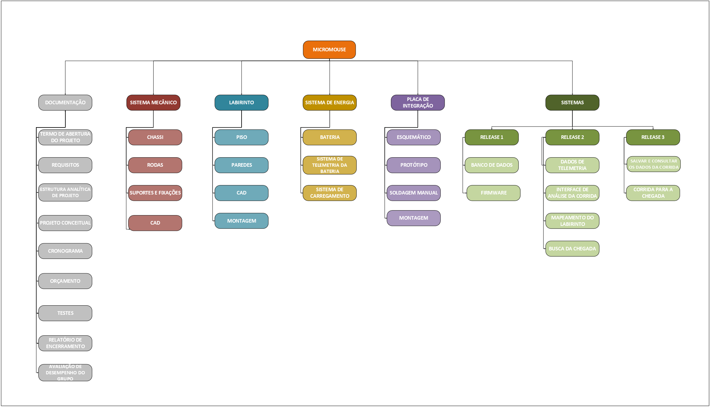

# Estrutura Analítica de Produto (EAP)

A EAP representa a decomposição hierárquica do escopo total do trabalho a ser executado pela equipe do projeto a fim de alcançar os objetivos e criar entregas exigida. A seguir, ilustra-se a EAP do Grupo 2, baseada nas entregas e pacotes de trabalho estabelecidos para o projeto.

