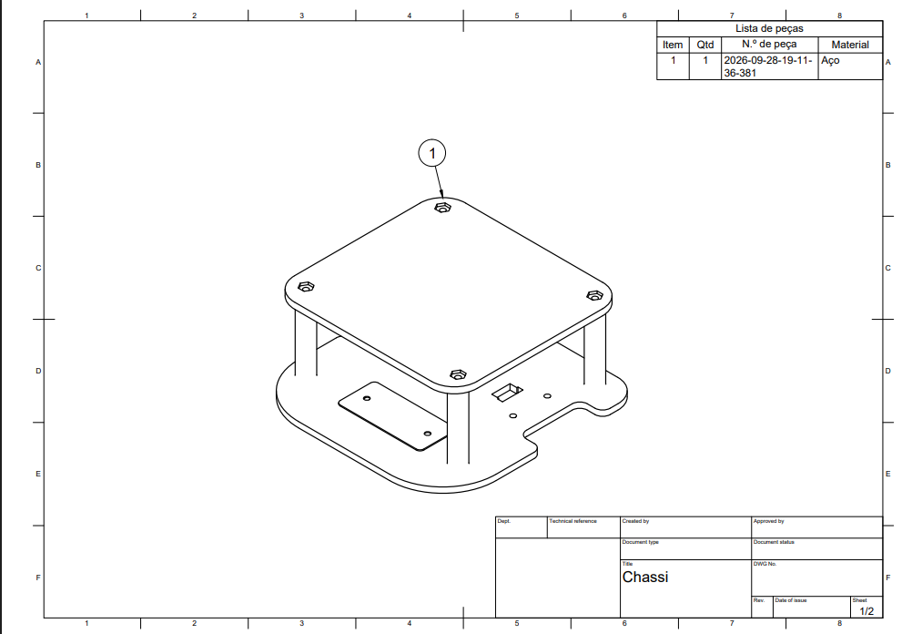
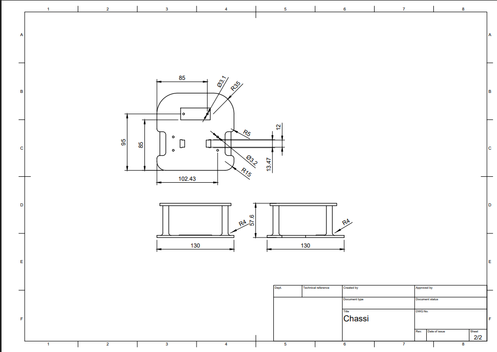

# Projeto Conceitual da Estrutura do  Produto

Apresentem o desenho em CAD do produto, indicando:

- Dimensões (lados, arestas e cotas);
- Materiais utilizados;
- Partes fundamentais (chassi, suporte, carenagem, atuadores, transmissão, rodas/hélices etc.);
- Explicação do desenho;
- Justificativa das principais decisões de projeto.

# Seleção de materiais e projeto conceitual de estruturas

## 1 Introdução

O presente relatório tem como objetivo analisar e comparar diferentes materiais que podem ser utilizados na fabricação do chassi e em demais componentes de um micromouse. O chassi será responsável por acomodar e fixar os principais componentes do robô, além de garantir estabilidade estrutural durante a movimentação. O ambiente de operação do robô é um labirinto formado por células padronizadas de 18 cm, o que impõe algumas restrições ao projeto. Para evitar o contato das laterais do robô com as paredes durante a navegação, a largura total do micromouse deve ser mantida inferior a 16,5 cm.

Outro aspecto considerado é a massa do robô, que deve permanecer aproximadamente na faixa de 300 g a 400 g. Dessa forma, a seleção dos materiais deve levar em conta características como densidade, rigidez, resistência mecânica e térmica, coeficiente de atrito, facilidade de fabricação e possibilidade de realizar alterações na geometria durante a etapa de prototipagem.

## 2 Análise dos materiais estruturais

A escolha do material utilizado no chassi influencia diretamente a massa do robô, sua rigidez, a estabilidade do Centro de Gravidade (CG), a resistência a impactos e a facilidade de montagem. Por isso, foram consideradas diferentes alternativas de fabricação utilizadas em projetos de robótica de pequeno porte.

### 2.1 MDF

O MDF apresenta como principais vantagens o baixo custo, a facilidade de obtenção e a simplicidade de fabricação. Por ser um material relativamente leve, pode ser utilizado em protótipos nos quais a redução de massa é importante.

Por outro lado, sua fabricação é predominantemente limitada a geometrias planas, principalmente quando são utilizados processos de corte a laser. Sua rigidez também é inferior à de materiais como o alumínio e alguns polímeros utilizados em impressão 3D.

**Pontos positivos:**

- Baixo custo;
- Fácil obtenção;
- Baixa massa;
- Fabricação simples.

**Pontos negativos:**

- Rigidez limitada;
- Fabricação predominantemente em 2D;
- Menor possibilidade de criar geometrias tridimensionais.

### 2.2 Acrílico

O acrílico apresenta boa rigidez e é bastante adequado para processos de corte a laser. A possibilidade de visualizar os componentes através do material também pode facilitar a inspeção da montagem.

Entretanto, apresenta comportamento mais frágil quando submetido a impactos. Trincas podem surgir durante a montagem ou em situações de colisão. Assim como o MDF, o corte a laser limita a fabricação principalmente a elementos planos, dificultando a criação de suportes e encaixes tridimensionais diretamente no material.

**Pontos positivos:**

- Boa rigidez;
- Fácil corte a laser;
- Boa precisão dimensional no corte;
- Possibilidade de visualização dos componentes.

**Pontos negativos:**

- Maior fragilidade em relação a impactos;
- Possibilidade de formação de trincas;
- Pouca flexibilidade para geometrias tridimensionais;
- Pode exigir peças adicionais para fixação de componentes.

### 2.3 Polímeros de impressão 3D

Os polímeros de impressão 3D, como PLA, PETG, ABS, ASA e Nylon, permitem produzir peças com geometrias personalizadas e diferentes níveis de preenchimento (infill). Isso possibilita ajustar a relação entre massa e rigidez de acordo com as necessidades do projeto.

Outra vantagem é a possibilidade de criar diretamente na peça elementos como suportes, encaixes, berços para motores e passagens para cabos. Essa característica pode simplificar a montagem e permitir alterações rápidas durante a fase de prototipagem.

Entretanto, as propriedades mecânicas e térmicas variam bastante entre os diferentes polímeros. Além disso, alguns materiais apresentam maior dificuldade de impressão e podem exigir controle de temperatura, ambiente de impressão e umidade.

**Pontos positivos:**

- Liberdade geométrica (suportes, encaixes e berços integrados à peça);
- Possibilidade de ajustar a relação massa/rigidez via infill;
- Facilita alterações rápidas durante a prototipagem.

**Pontos negativos:**

- Propriedades mecânicas e térmicas variam significativamente entre os polímeros;
- Alguns materiais exigem controle de temperatura e umidade durante a impressão;
- Possível anisotropia mecânica entre camadas (peça mais fraca em uma direção).

#### 2.3.1 Análise dos coeficientes de atrito

O coeficiente de atrito varia de acordo com o material e também com a superfície de contato. Dessa forma, os valores devem ser analisados considerando o tipo de piso encontrado no ambiente de operação.

**Tabela 1 — Coeficientes de atrito estimados por material e superfície**

| Material | Asfalto | MDF | Vidro |
|---|---:|---:|---:|
| PLA | 0,4–0,5 | 0,5–0,6 | 0,3–0,4 |
| PETG | 0,3–0,4 | 0,4–0,5 | 0,15–0,25 |
| ABS | 0,5–0,6 | 0,4–0,55 | 0,2–0,3 |
| ASA | 0,5–0,6 | 0,4–0,55 | 0,2–0,3 |
| Nylon | 0,4–0,5 | 0,3–0,45 | 0,15–0,25 |
| TPU | 0,6–0,8 | 0,5–0,7 | 0,5–0,6 |

Os valores apresentados mostram que o comportamento do atrito depende fortemente do par de materiais em contato. Para as rodas, um coeficiente de atrito mais elevado pode ser interessante para aumentar a aderência com o piso e reduzir a possibilidade de derrapagem.

#### 2.3.2 Comparação do comportamento térmico

Para os polímeros, uma propriedade importante é a Temperatura de Transição Vítrea. Quando a temperatura se aproxima dessa faixa, o comportamento do material pode passar de mais rígido para mais deformável, o que pode alterar sua geometria e suas propriedades mecânicas.

Por isso, além do coeficiente de atrito, a resistência térmica do material deve ser considerada na comparação das alternativas utilizadas no chassi.

**Tabela 2 — Temperatura de transição vítrea e risco térmico**

| Material | Tg aproximada | Análise |
|---|---:|---|
| PLA | 60–65 °C | Maior sensibilidade térmica |
| PETG | 75–85 °C | Sensibilidade térmica intermediária |
| ABS | 105–115 °C | Maior resistência térmica |
| ASA | 110–120 °C | Maior resistência térmica |
| Nylon | 45–70 °C | Tg variável, mas elevada tenacidade |
| TPU | — | Material flexível, comportamento diferente dos termoplásticos rígidos |
| PTFE | > 300 °C | Elevada resistência térmica |

A comparação indica que PLA e PETG apresentam temperaturas de transição vítrea menores que ABS e ASA, o que deve ser considerado caso o componente seja submetido a temperaturas elevadas. O Nylon, apesar de apresentar elevada tenacidade, possui valores de Tg que variam de acordo com sua composição. O TPU apresenta comportamento diferente por ser um elastômero, enquanto o PTFE possui elevada resistência térmica.

## 3 Escolhas

A escolha do material também depende da função que cada componente desempenha no robô.

### 3.1 Chassi

O chassi precisa apresentar rigidez suficiente para manter os componentes fixos e evitar deformações durante a movimentação. Também é importante considerar a resistência a impactos, a estabilidade dimensional e a massa.

Entre os materiais analisados, os polímeros de impressão 3D permitem maior liberdade geométrica, possibilitando a criação de berços para os motores e suportes personalizados. ABS e ASA apresentam maior resistência térmica que PLA e PETG, enquanto o Nylon apresenta elevada tenacidade.

O PLA possui como vantagem a facilidade de impressão, mas sua menor resistência térmica pode ser uma limitação dependendo das condições de operação.

Considerando os fatores analisados, o PLA foi escolhido para o chassi. A decisão se baseia principalmente na facilidade de impressão e na liberdade geométrica da manufatura aditiva, que permite integrar diretamente à peça berços para os motores, suportes e passagens para cabos. A menor resistência térmica do PLA em relação a ABS e ASA não representa restrição relevante para este projeto, já que o chassi não fica exposto a fontes de calor significativas durante a operação do robô.

### 3.2 Rodas motorizadas

As rodas motorizadas têm a função de transmitir o torque dos motores ao piso e gerar a força de tração necessária para a movimentação do robô.

Para o projeto, foi selecionada a StickyMAX S20 Macia de 22 mm. A roda possui diâmetro externo de 22 mm e largura de 16 mm. Seu cubo é fabricado em alumínio 6351-T6, enquanto o pneu é constituído por borracha de silicone ultra-resistente com dureza de 20 Shore-A.

A baixa dureza do pneu e sua característica pegajosa favorecem a aderência ao piso. Isso é particularmente relevante para um micromouse, pois a transmissão eficiente do torque das rodas para o piso é necessária para reduzir a derrapagem durante acelerações, frenagens e mudanças de direção.

## 4 Projeto estrutural e dimensionamento

Após a definição dos materiais e das rodas utilizadas no robô, foi realizado o desenvolvimento do modelo estrutural. O projeto foi elaborado considerando as dimensões do labirinto, o espaço necessário para os componentes eletrônicos e mecânicos e a movimentação do robô durante o percurso.

Durante o desenvolvimento foram consideradas três possibilidades para a geometria do chassi: circular, quadrada e em formato de D. A configuração circular apresenta como vantagem a redução de quinas, porém limita o aproveitamento da área interna para a disposição dos componentes. A configuração quadrada permite melhor aproveitamento do espaço, mas apresenta extremidades que aumentam a área ocupada durante determinadas manobras.

Dessa forma, optou-se pela configuração em formato de D, buscando aproveitar o espaço interno para a disposição dos componentes e, ao mesmo tempo, reduzir as regiões que poderiam dificultar a movimentação do robô dentro das células.

Além disso, foi adotada uma estrutura dividida em dois níveis. A utilização de um segundo piso permite distribuir os componentes verticalmente, aumentando a área disponível para montagem sem aumentar as dimensões externas do robô.

### 4.1 Dimensões gerais do chassi

O chassi possui dimensões máximas de **130 mm × 130 mm**. Essas dimensões foram definidas considerando que o robô deverá se deslocar em células de 180 mm, mantendo uma margem para movimentação em relação às paredes do labirinto.

A geometria da base inferior apresenta recortes destinados à instalação e fixação dos componentes mecânicos. No desenho técnico também estão indicadas dimensões internas utilizadas para o posicionamento desses elementos, como 102,43 mm, 95 mm e 85 mm, além de raios de 5 mm, 15 mm e 35 mm empregados na construção da geometria.

A distância vertical total indicada entre os níveis é de **57,6 mm**. A adoção de dois níveis permite separar a disposição dos componentes e aproveitar melhor o volume disponível, evitando a necessidade de aumentar as dimensões em planta do chassi.

*Figura 1 — Modelo estrutural e principais dimensões do chassi.*

### 4.2 Segundo nível

O segundo nível apresenta dimensões máximas de **120 mm × 112,5 mm**, sendo menor que a base inferior. A peça possui espessura de **4 mm** e quatro pontos de fixação com furos de 3,2 mm de diâmetro. Os cantos apresentam raio de 15 mm.

A redução das dimensões do segundo nível em relação ao primeiro permite que a estrutura superior permaneça dentro dos limites externos definidos pelo chassi. Os quatro pontos de fixação são utilizados para realizar a união entre os dois níveis por meio de espaçadores.

A utilização do segundo nível foi adotada devido à necessidade de acomodar os componentes do robô sem aumentar significativamente sua largura e comprimento. Dessa forma, parte dos componentes pode ser posicionada na região superior, enquanto os elementos relacionados à locomoção permanecem associados à estrutura inferior.

### 4.3 Sistema de locomoção

O sistema de locomoção foi definido utilizando **duas rodas motorizadas e uma roda boba**. A utilização de duas rodas com acionamento independente permite realizar a movimentação diferencial do robô. Com a variação do sentido e da velocidade de rotação de cada roda, é possível realizar mudanças de direção e rotações dentro das células do labirinto.

A roda selecionada foi a StickyMAX S20 Macia de 22 mm, apresentada anteriormente na análise de materiais. O modelo possui **22 mm de diâmetro externo e 16 mm de largura**, dimensões consideradas durante o posicionamento dos motores e dos suportes no chassi.

Considerando o diâmetro da roda:

$$
h=\frac{D}{2}
$$

$$
h=\frac{22}{2}=11\text{ mm}
$$

Portanto, o centro do eixo da roda fica aproximadamente **11 mm acima do solo**, considerando a roda sem deformação significativa.

Essa dimensão deve ser considerada no projeto dos berços dos motores e na posição dos demais elementos mecânicos. A altura da roda também influencia diretamente a altura do chassi em relação ao piso e a posição do Centro de Gravidade.

A roda possui largura de 16 mm, portanto também é necessário verificar a distância entre as faces internas das rodas e os componentes do chassi, garantindo que o pneu tenha espaço suficiente para deformação durante o contato com o piso sem interferir na estrutura.

**[INSERIR DESENHO TÉCNICO DA RODA]**

*Figura 3 — Dimensões principais da roda StickyMAX S20.*

### 4.4 Fixação dos motores

Para a montagem dos motores foi desenvolvido um suporte específico, responsável por manter cada motor posicionado em relação ao chassi e ao eixo das rodas.

A peça possui dimensão externa máxima de aproximadamente **31 mm**, com corpo de 24,7 mm na direção indicada no desenho e largura lateral de 11,35 mm. A fixação é realizada por furos de **3,2 mm de diâmetro**. O desenho também apresenta raios de 1 mm e 4,25 mm nas regiões de transição da geometria.

A utilização de uma peça específica para a fixação permite manter o posicionamento dos motores definido no CAD e facilita a montagem e desmontagem do conjunto.

**[INSERIR DESENHO TÉCNICO DA FIXAÇÃO DO MOTOR]**

*Figura 4 — Dimensões do suporte utilizado para fixação dos motores.*

### 4.5 Roda boba

Como terceiro ponto de apoio foi adotada uma roda boba. Esse elemento auxilia na sustentação da estrutura sem impedir as mudanças de direção realizadas pelo acionamento diferencial das rodas motorizadas.

O conjunto é constituído por uma base e uma esfera. A esfera utilizada possui **15 mm de diâmetro**.

A base da roda boba possui **48 mm de comprimento**, com elementos destinados ao posicionamento da esfera e à fixação do conjunto ao chassi. Entre as dimensões indicadas no desenho estão altura de 11 mm para os elementos superiores, espessura de 1,5 mm na região da base e furos de 3 mm de diâmetro.

A utilização desse sistema completa os três pontos de contato do robô com o piso. A configuração foi escolhida para permitir que o robô realize rotações dentro das células de 180 mm sem que um terceiro elemento motorizado seja necessário.

**[INSERIR DESENHOS TÉCNICOS DA BASE E DA ESFERA]**

*Figura 5 — Base e esfera utilizadas no terceiro ponto de apoio.*

### 4.6 Elementos de fixação

Além dos suportes dos motores, foram desenvolvidas peças auxiliares para a montagem da estrutura. Entre elas encontra-se a trava em L, utilizada como elemento de fixação.

A peça possui dimensões máximas de aproximadamente **26 mm × 19 mm × 17 mm**, com furos de **3,2 mm de diâmetro** e raio interno de 5 mm. Os centros dos principais furos apresentam distâncias de 20 mm e 23 mm, conforme indicado no desenho técnico.

A utilização de elementos de fixação separados permite realizar a montagem das partes do robô e facilita possíveis alterações durante a etapa de prototipagem.

**[INSERIR DESENHO TÉCNICO DA TRAVA EM L]**

*Figura 6 — Dimensões da trava utilizada na montagem da estrutura.*

### 4.7 Relação entre roda, torque e velocidade

A redução do diâmetro da roda também influencia a relação entre a velocidade angular do motor e a velocidade linear do robô.

A velocidade linear pode ser relacionada à velocidade angular da roda por:

$$
v=\omega r
$$

em que:

- $v$ = velocidade linear do robô [m/s];
- $\omega$ = velocidade angular da roda [rad/s];
- $r$ = raio da roda [m].

Para a roda StickyMAX S20:

$$
r=\frac{22}{2}\text{ mm}=11\text{ mm}=0,011\text{ m}
$$

Assim, para uma mesma velocidade angular do motor, a utilização de uma roda de menor diâmetro resulta em menor velocidade linear, mas aumenta a força de tração disponível na região de contato, considerando o mesmo torque aplicado no eixo.

### 4.8 Configuração final

A configuração estrutural final é composta pelo **chassi inferior em formato de D, segundo nível, dois conjuntos de motor e roda, roda boba e elementos auxiliares de fixação**.

As dimensões gerais do chassi foram mantidas abaixo das dimensões das células do labirinto. A base possui dimensões máximas de 130 mm × 130 mm, enquanto as células possuem 180 mm. Dessa forma, considerando somente o chassi e seu posicionamento centralizado, existe uma diferença total de 50 mm entre sua dimensão externa e a dimensão da célula.

A utilização do formato em D foi escolhida buscando conciliar o espaço disponível para a instalação dos componentes com a movimentação dentro do labirinto. O segundo nível aumenta a área útil para a distribuição dos componentes sem aumentar a área ocupada pelo robô no plano horizontal.

A configuração com duas rodas motorizadas permite realizar o controle diferencial da movimentação, enquanto a roda boba funciona como terceiro ponto de apoio. Os suportes e elementos de fixação foram modelados de acordo com a posição dos componentes, permitindo que o conjunto seja montado conforme definido no CAD.

**[INSERIR VISTA ISOMÉTRICA DA MONTAGEM COMPLETA]**

*Figura 7 — Configuração final do projeto estrutural do Micromouse.*

## 5 Referências

ROBOCORE. *StickyMAX - Roda S20 Macia - 22 mm*. RoboCore.

ROBOCORE. *StickyMAX - Pneus S20 Macios - 22 mm (Par)*. RoboCore.

BERTHOLD, R.; BURGNER-KAHRS, J.; WANGENHEIM, M.; KAHMS, S. Investigating frictional contact behavior for soft material robot simulations. *Meccanica*, v. 58, n. 11, p. 2165–2176, 2023. DOI: 10.1007/s11012-023-01719-5.

MISHRA, R. et al. FFF 3D Printing in Electronic Applications: Dielectric and Thermal Properties of Selected Polymers. *Polymers*, 2021.

XYDAS, N.; KAO, I. Modeling of Contact Mechanics and Friction Limit Surfaces for Soft Fingers in Robotics, with Experimental Results. *The International Journal of Robotics Research*, v. 18, n. 9, 1999. DOI: 10.1177/02783649922066673.
