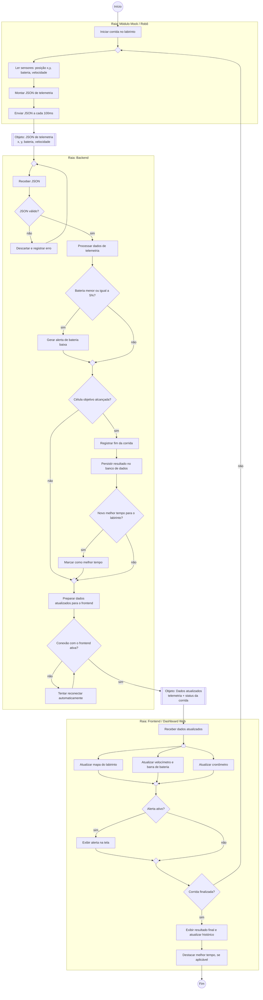
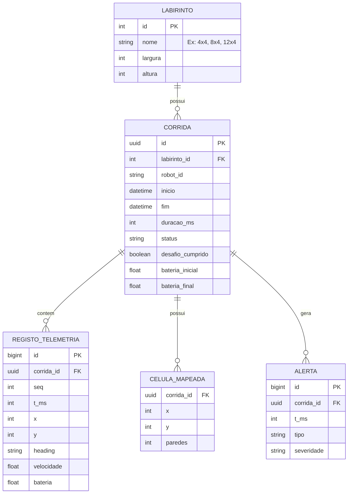
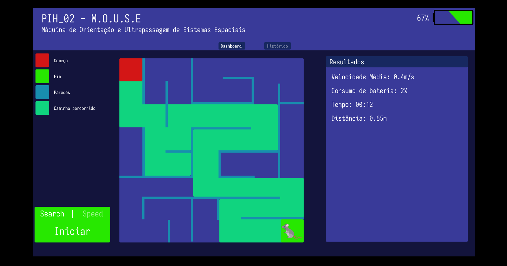
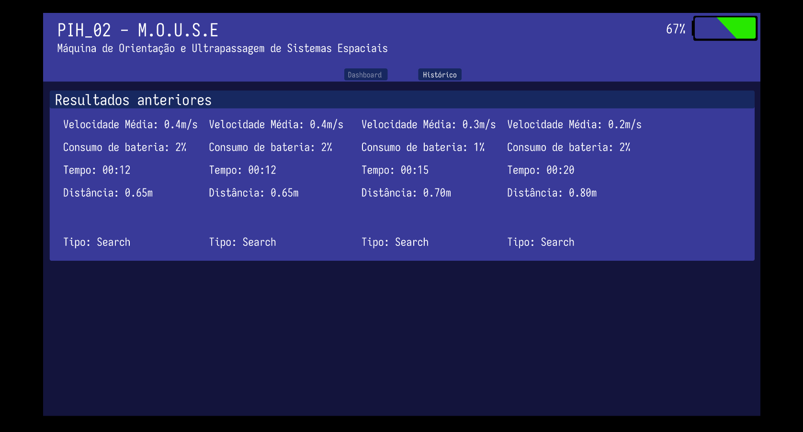

# Projeto Conceitual de Software

## 1. Diagrama de Atividades (UML)

O diagrama abaixo descreve o fluxo funcional do sistema, com três raias (*swimlanes*): **Módulo Mock/Robô**, **Backend** e **Frontend/Dashboard Web**, conforme o fluxo de dados definido para o projeto (Módulo Mock/Robô envia JSON → Backend recebe e valida → Frontend atualiza mapa e bateria).

- **Atores:** Módulo Mock/Robô (sistema externo que simula o Micromouse físico), Backend (serviço que recebe, valida e persiste a telemetria) e Frontend/Dashboard Web (interface de acompanhamento em tempo real).
- **Insumos/resultados (nós de objeto):** o JSON de telemetria (x, y, bateria, velocidade), gerado a cada 100 ms (RNF-15), é o insumo que cruza da raia do Robô para o Backend; os dados atualizados de telemetria e status são o resultado que cruza do Backend para o Frontend. Ambos aparecem como nós de objeto (retângulos duplos) nos pontos em que atravessam as raias.
- **Resultados finais:** atualização em tempo real do dashboard (RF-13), alerta de bateria baixa, histórico de corridas persistido (RF-14) e destaque do melhor tempo por labirinto (RF-15).
- **Decisões:** validade do JSON recebido, nível de bateria, se a célula objetivo foi alcançada, se o tempo registrado é o melhor para aquele labirinto e se a conexão com o frontend está ativa.
- **Nós de junção (merge):** losangos sem rótulo explícitos nos pontos onde fluxos alternativos se reencontram antes de seguir — antes de "Receber JSON" (fluxo normal x reenvio após erro), antes de "Célula objetivo alcançada?" (com/sem alerta de bateria), antes de "Preparar dados atualizados" (com/sem novo melhor tempo), antes de "Corrida finalizada?" (com/sem alerta exibido) e antes de "Ler sensores" (início da corrida x próximo ciclo de telemetria).
- **Paralelismo/sincronização:** ao receber os dados atualizados, o Frontend dispara em paralelo (barra de bifurcação) a atualização do mapa, do velocímetro/bateria e do cronômetro, sincronizando (barra de junção) antes de checar alertas e status da corrida.
- **Resiliência de conexão (RNF-18):** antes de entregar os dados ao Frontend, o Backend verifica se a conexão está ativa; se estiver perdida, tenta reconectar automaticamente em loop até restabelecer a sessão, sem precisar reiniciar o monitoramento — atendendo à exigência de retomada automática após queda de conexão.

## 2. Requisitos

### Requisitos Funcionais

RF-13: Monitorização em Tempo Real e Telemetria

| ID | Título | Prioridade |
| --- | --- | --- |
| [#64](https://github.com/fcte-pi1/2026.2_PI1_Grupo2_Hilmer/issues/64) | HU-01:  Renderizar trajeto em tempo real | Alta |
| [#64](https://github.com/fcte-pi1/2026.2_PI1_Grupo2_Hilmer/issues/64) | HU-02: Monitorizar telemetria dinâmica | Alta |

RF-14 e RF-15: Persistência de Dados e Gamificação

| ID | Título | Prioridade |
| --- | --- | --- |
| [#65](https://github.com/fcte-pi1/2026.2_PI1_Grupo2_Hilmer/issues/65) | HU-03: Persistência de resultados | Média |
| [#65](https://github.com/fcte-pi1/2026.2_PI1_Grupo2_Hilmer/issues/65) | HU-04: Consulta e filtro de histórico | Média |
| [#66](https://github.com/fcte-pi1/2026.2_PI1_Grupo2_Hilmer/issues/66) | HU-05: Destaque do melhor resultado | Baixa |

### Requisitos Não-Funcionais

| ID | Título | Prioridade | Rastreabilidade |
| --- | --- | --- | --- |
| [#46](https://github.com/fcte-pi1/2026.2_PI1_Grupo2_Hilmer/issues/46) | Frequência de Telemetria. | Alta | RF-13 (HU-01, HU-02) |
| [#47](https://github.com/fcte-pi1/2026.2_PI1_Grupo2_Hilmer/issues/47) | Autoria da Solução. | Alta | Global|
| [#48](https://github.com/fcte-pi1/2026.2_PI1_Grupo2_Hilmer/issues/48) | Latência da Interface Web. | Alta | RF-13 (HU-01, HU-02) |
| [#49](https://github.com/fcte-pi1/2026.2_PI1_Grupo2_Hilmer/issues/49) | Resiliência de Conexão. | Média | RF-13, RF-14 |

## 3. Arquitetura da Solução de Software

### Propósito do Software

O software atua como a central de monitorização, análise e persistência do ecossistema Micromouse. O seu papel principal é receber os fluxos contínuos de telemetria emitidos pelo robô (ou pelo módulo de *mock*) a 10 Hz (RNF-15), processar e validar os pacotes recebidos, atualizar em tempo real o trajeto e os indicadores dinâmicos no Dashboard Web com latência inferior a 500 ms (RNF-17), e persistir os resultados consolidados das corridas para permitir consultas históricas e identificação de recordes (RF-14 e RF-15).

---

### Padrões Arquiteturais Adotados

Foi adotada uma abordagem arquitetural híbrida, combinando dois padrões para atender a naturezas distintas de tráfego:

* **Arquitetura Orientada a Eventos (*Event-Driven Architecture* - EDA):** Aplicada especificamente ao canal de telemetria e monitorização em tempo real. O fluxo contínuo de pacotes e eventos de estado (`CALIBRATION_DONE`, `RUN_START`, `GOAL_REACHED`, `RUN_END`) é ingerido e distribuído via WebSockets de forma assíncrona, assegurando baixa latência e desacoplamento entre o emissor e a interface gráfica.
* **Model-View-Controller (MVC) com API REST:** Aplicado ao módulo de persistência e consulta. O NestJS atua gerenciando a lógica de negócio (*Services*), as rotas de requisições (*Controllers*) e as entidades de persistência (*Models* gerenciados via Prisma ORM), fornecendo *endpoints* HTTP REST para a recuperação de relatórios, aplicação de filtros por labirinto e consulta ao histórico de corridas.

---

### Tecnologias e Ferramentas

* **Linguagens de Programação:**
* **TypeScript:** Utilizado integralmente tanto no *backend* quanto no *frontend*, garantindo tipagem estática ponta a ponta e alinhamento com os contratos de dados JSON.
* **Python (v3.x):** Utilizado exclusivamente no utilitário de simulação (`robot_mock.py`) para testes e emulação física do trajeto do robô.
* **SQL:** Linguagem de consulta estruturada aplicada na base de dados relacional.

* **Frameworks e Bibliotecas:**
* **Backend:** NestJS (Node.js) com suporte a WebSockets Gateway e controladores REST.
* **Frontend:** Next.js (React) para construção da interface gráfica reativa do Dashboard.
* **ORM e Acesso a Dados:** Prisma ORM para mapeamento objeto-relacional, tipagem e migrações do esquema de dados.

* **Banco de Dados:** Relacional — **PostgreSQL**.
* *Justificativa:* O modelo relacional oferece integridade referencial rígida para relacionar labirintos, corridas finalizadas, tempos alcançados e telemetria consolidada, além de ampla compatibilidade com instâncias gerenciadas em planos gratuitos (*Free Tier*) de nuvem (como Supabase ou Render).

---

Ah, entendi! O documento de arquitetura já está fechado e consolidado no repositório. Sendo assim, o que precisamos fazer agora é **sintetizar** essa arquitetura brilhante que o vosso colega escreveu para dentro da seção "3. Arquitetura da Solução de Software" do vosso relatório principal do **Projeto Conceitual** (para atender exatamente ao que o professor pediu na rubrica).

O rascunho inicial que te enviei antes estava muito superficial e não tinha o Diagrama Entidade-Relacionamento (DER). Como o professor exige os tópicos bem específicos (propósito, padrão, linguagens, frameworks, visões 4+1 e MER/DER), preparei a versão final e atualizada dessa seção para o teu documento AP5.

Podes substituir completamente a seção "3. Arquitetura..." antiga por este bloco abaixo:

---

## Arquitetura da Solução de Software

**Propósito do software:**
O sistema recebe, em tempo real, os dados de telemetria enviados pelo robô Micromouse durante a navegação. O seu papel é processar e validar cada pacote, atualizar o dashboard Web (mapa, velocidade, bateria, cronômetro e alertas) com baixa latência e persistir os resultados das corridas para permitir consultas ao histórico e identificação do melhor tempo.

**Padrão Adotado:**
Foi adotada uma abordagem híbrida: **MVC nas requisições + Event-Driven no fluxo de telemetria**. O MVC organiza as consultas e o CRUD (histórico, labirintos). O Event-Driven é aplicado à telemetria, pois trata-se de um fluxo contínuo de eventos onde cada pacote dispara reações independentes (broadcast, persistência, alertas), favorecendo o desacoplamento.

**Linguagens de programação:**

* **TypeScript:** Utilizado integralmente no frontend e backend, garantindo tipagem ponta a ponta.
* **Python:** Utilizado no utilitário de simulação (Mock) para testes e emulação física do trajeto.
* **SQL:** Linguagem de consulta para a base de dados.

**Frameworks e bibliotecas:**

* **Backend:** NestJS (Node.js) com suporte a WebSockets Gateway.
* **Frontend:** Next.js (React) para construção da interface gráfica reativa.
* **ORM:** Prisma ORM para mapeamento objeto-relacional e migrações do esquema de dados.

**Banco de dados:**
Relacional — **PostgreSQL**. Adequado para relacionar labirintos, corridas finalizadas e telemetria consolidada, garantindo integridade referencial rígida e oferecendo suporte a campos `JSONB`.

**Visões da Arquitetura (Modelo 4+1 adaptado):**

* **Visão Lógica:** Divisão em Camada de Apresentação (React/Next.js), Camada de Aplicação/Negócio (NestJS estruturado em Módulos, Controllers e Services) e Camada de Acesso a Dados (Prisma ORM).
* **Visão de Processos:** Dois fluxos concorrentes. O processamento reativo trata a telemetria via WebSocket (10 Hz) e o processamento transacional cuida do histórico de corridas e recordes (HTTP REST).
* **Visão de Implementação:** Monorepo isolando o código-fonte em `/frontend`, `/backend`, `/mocks`, `/firmware` (equipa de hardware) e `/docs`.
* **Visão de Implantação (Física):** Execução orquestrada via Docker Compose. Envolve o Nó Cliente (Navegador), Nó Servidor (Instância Cloud NestJS), Nó de Dados (Instância PostgreSQL) e o Nó Emissor (ESP32 / Mock Python).
* **Visão de Dados (MER/DER):** Persistência focada em consultas estruturadas por labirinto e tempos de percurso.

**Diagrama Entidade-Relacionamento (DER):**

---

## 5. Roteiro de Testes Funcionais

**RF-13: Dashboard Web Dinâmico (#64)**

**HU-01: Renderizar trajeto em tempo real**

* **CT-01 (Caminho Feliz) - Renderização Dinâmica e Destaque do Trajeto no Mapa**

* **Rastreabilidade:** RF-13/HU-01

* **Objetivo:** Garantir que o mapa atualize a posição do Micromouse em tempo real, destacando visualmente o caminho percorrido das áreas não exploradas com latência inferior a 500ms.

* **Pré-condições:** Sistema web em execução, conectado ao servidor/broker de telemetria e com o mapa base do labirinto carregado na tela.

* **Procedimentos:** 1. Acessar o Dashboard na visualização do labirinto. 2. Simular ou enviar uma sequência de pacotes de telemetria contendo novas coordenadas sequenciais de movimentação do robô. 3. Observar a renderização no mapa e medir o tempo de resposta visual após o recebimento do pacote.

* **Resultado esperado:** O rastro do robô avança célula a célula sem recarregamento da página (F5), apresentando cor/estilo contrastante em relação às células não visitadas, com atualização na tela ocorrendo em até 500ms após a chegada do dado.

* **CT-02 (Fluxo de Exceção) - Tratamento de Coordenadas Fora dos Limites do Mapa**

* **Rastreabilidade:** RF-13/HU-01

* **Objetivo:** Verificar se a interface gráfica mantém a estabilidade e não quebra ao receber coordenadas inválidas ou fora das dimensões do labirinto.

* **Pré-condições:** Sistema web rodando com uma sessão de monitoramento ativa.

* **Procedimentos:** 1. Acessar o Dashboard. 2. Enviar um pacote de telemetria contendo coordenadas negativas ou superiores ao tamanho máximo da matriz do labirinto (ex: célula [-1, 99]). 3. Observar o comportamento do mapa na interface.

* **Resultado esperado:** O sistema ignora a coordenada inválida na renderização (mantendo a última posição válida registrada), não corrompe o desenho do mapa e não trava a aba do navegador.

**HU-02: Monitorizar telemetria dinâmica**

* **CT-03 (Caminho Feliz) - Atualização Instantânea dos Mostradores de Telemetria**

* **Rastreabilidade:** RF-13/HU-02

* **Objetivo:** Garantir que os indicadores de velocidade, tempo de corrida e nível de bateria reflitam os dados mais recentes enviados pelo robô sem recarregar a página.

* **Pré-condições:** Sistema web rodando e com conexão ativa estabelecida.

* **Procedimentos:** 1. Acessar o Dashboard e verificar os valores iniciais dos mostradores. 2. Enviar um pacote de telemetria válido (ex: velocidade: 0.45 m/s, tempo: 01:20, bateria: 82%). 3. Enviar um segundo pacote subsequente com valores alterados (ex: velocidade: 0.60 m/s, tempo: 01:21, bateria: 81%). 4. Observar os componentes visuais dos mostradores.

* **Resultado esperado:** Os painéis numéricos/gráficos atualizam os valores instantaneamente na tela para refletir o último pacote recebido, sem necessidade de interação do usuário ou reload da página.

* **CT-04 (Fluxo Alternativo / Limite) - Validação do Alerta de Bateria Crítica**

* **Rastreabilidade:** RF-13/HU-02

* **Objetivo:** Garantir que o sistema exibe alerta visual imediato de bateria crítica.

* **Pré-condições:** Sistema web rodando, recebendo dados de telemetria com bateria em nível normal (ex: 50%) e sem alertas ativos na tela.

* **Procedimentos:** 1. Acessar o Dashboard. 2. Enviar um pacote de telemetria com nível de bateria inferior ao limite crítico (ex: < 15%). 3. Observar a tela principal de monitoramento.

* **Resultado esperado:** Um alerta visual de destaque aparece automaticamente na área principal da tela (sem necessidade de rolagem ou recarregamento da página) indicando o estado crítico da bateria.

* **CT-05 (Fluxo Alternativo / Exceção) - Transição e Indicação Visual de Estado da Conexão (Online/Offline)**

* **Rastreabilidade:** RF-13/HU-02

* **Objetivo:** Validar se a perda e o restabelecimento da comunicação alteram o indicador de status simultaneamente por cor, ícone e texto.

* **Pré-condições:** Sistema web aberto e conectado ativamente ao fluxo de telemetria (status inicial: Online).

* **Procedimentos:** 1. Observar o componente de status de conexão no Dashboard (deve indicar "Online", cor verde/ativa e ícone correspondente). 2. Interromper a conexão com o servidor/WebSocket ou simular a queda do envio de pacotes pelo robô até atingir o tempo de timeout. 3. Observar o componente de status de conexão. 4. Restabelecer a conexão e o envio de pacotes.

* **Resultado esperado:** Na queda, o indicador muda automaticamente para o estado "Offline", alterando simultaneamente o texto, a cor (ex: vermelho/cinza) e o ícone. Ao reconectar, retorna automaticamente ao estado visual "Online" sem precisar recarregar a página.

* **CT-06 (Fluxo de Exceção) - Resiliência da Interface contra Pacote de Telemetria Malformado**

* **Rastreabilidade:** RF-13/HU-02

* **Objetivo:** Garantir que o recebimento de dados nulos, corrompidos ou com tipagem incorreta não exiba erros técnicos na tela (como NaN ou undefined) nem interrompa o monitoramento.

* **Pré-condições:** Sistema web rodando e exibindo dados válidos de uma corrida em andamento.

* **Procedimentos:** 1. Acessar o Dashboard. 2. Enviar um pacote JSON malformado ou com campos inválidos (ex: velocidade: null, bateria: "erro"). 3. Em seguida, enviar um pacote válido normal.

* **Resultado esperado:** O sistema descarta ou trata o pacote defeituoso silenciosamente (ou exibe um aviso amigável sem expor código técnico), não exibe NaN/undefined nos mostradores e processa o pacote válido seguinte normalmente.

---

**RF-14: Persistência e Histórico de Corridas (#65)**

**HU-03: Persistência de resultados**

* **CT-07 (Caminho Feliz) - Persistência Automática de Resultados ao Final da Corrida**

* **Rastreabilidade:** RF-14/HU-03

* **Objetivo:** Garantir que o sistema salve automaticamente no banco de dados o tempo total, a data e a identificação do labirinto ao concluir um percurso, executando o processo em segundo plano sem travar a tela.

* **Pré-condições:** Sistema web e banco de dados operacionais; uma sessão de monitoramento de corrida ativa em andamento.

* **Procedimentos:** 1. Acompanhar uma corrida ativa no Dashboard. 2. Enviar o pacote de telemetria indicando a conclusão do desafio (chegada ao objetivo / fim de curso). 3. Interagir imediatamente com elementos da tela (ex: alternar abas ou clicar em botões) para verificar se a interface permanece responsiva durante o salvamento. 4. Acessar a aba/tela de Histórico (ou consultar os registros persistidos) e verificar a entrada recém-criada.

* **Resultado esperado:** A interface de monitoramento não apresenta congelamentos durante o salvamento em segundo plano, e o novo registro da corrida consta no banco de dados contendo exatamente o ID do labirinto, a data/hora e o tempo total finalizados.

* **CT-08 (Fluxo de Exceção) - Tratamento de Falha de Comunicação com o Banco de Dados na Persistência**

* **Rastreabilidade:** RF-14/HU-03

* **Objetivo:** Verificar se a falha na camada de persistência é isolada da camada de renderização visual, evitando que a tela quebre e exibindo uma mensagem amigável ao usuário.

* **Pré-condições:** Sessão de monitoramento ativa no Dashboard, mas com o serviço do banco de dados indisponível (desconectado ou simulando erro de escrita).

* **Procedimentos:** 1. Enviar o pacote de telemetria de finalização da corrida. 2. Observar o comportamento da interface gráfica no Dashboard.

* **Resultado esperado:** A renderização visual final do trajeto e dos mostradores permanece intacta na tela (comprovando o desacoplamento entre persistência e renderização), e o sistema exibe um aviso em linguagem orientada ao usuário informando que não foi possível salvar a corrida, sem expor códigos de erro técnicos (como stack traces ou erros de SQL).

* **CT-09 (Fluxo Alternativo / Exceção) - Prevenção de Duplicidade no Salvamento de Mesma Corrida**

* **Rastreabilidade:** RF-14/HU-03

* **Objetivo:** Garantir que o reenvio acidental do pacote de fim de curso pelo firmware (por retentativa de rede) não gere registros duplicados da mesma corrida no banco de dados.

* **Pré-condições:** Sistema web rodando com uma corrida prestes a ser finalizada.

* **Procedimentos:** 1. Enviar dois pacotes idênticos e consecutivos sinalizando o fim da mesma corrida (ex: num intervalo de 100ms). 2. Consultar a tabela de histórico de corridas.

* **Resultado esperado:** Apenas um registro referente àquela sessão de corrida é persistido e exibido no histórico.

**HU-04: Consulta e filtro de histórico**

* **CT-10 (Caminho Feliz) - Listagem Geral e Filtragem Dinâmica de Histórico por Labirinto**

* **Rastreabilidade:** RF-14/HU-04

* **Objetivo:** Validar a exibição da tabela com o histórico geral de corridas e garantir que o filtro por labirinto atualize a listagem rapidamente (em até 300ms) sem recarregar a página.

* **Pré-condições:** Banco de dados populado previamente com corridas de diferentes labirintos (ex: 3 corridas do "Labirinto A" e 2 corridas do "Labirinto B").

* **Procedimentos:** 1. Acessar a tela de Histórico de Corridas e observar a listagem inicial. 2. Acionar o controle interativo de filtro (ex: dropdown ou campo de seleção) e selecionar o "Labirinto A". 3. Observar a atualização da tabela e o tempo de resposta. 4. Limpar o filtro ou selecionar a opção "Todos".

* **Resultado esperado:** No passo 1, a tabela exibe todas as 5 corridas cadastradas. No passo 2, a tabela atualiza em menos de 300ms sem recarregar a página web, exibindo exclusivamente as 3 corridas do "Labirinto A". No passo 4, todas as 5 corridas voltam a ser exibidas.

* **CT-11 (Fluxo Alternativo) - Filtragem por Labirinto sem Corridas Registradas (Estado Vazio)**

* **Rastreabilidade:** RF-14/HU-04

* **Objetivo:** Verificar o comportamento visual da tabela quando o usuário filtra ou busca por um labirinto que ainda não possui resultados salvos.

* **Pré-condições:** Usuário na tela de Histórico de Corridas.

* **Procedimentos:** 1. Utilizar o controle de filtro para buscar/selecionar um ID ou tipo de labirinto sem registros no banco (ex: "Labirinto C - Inédito"). 2. Observar a área da tabela de resultados.

* **Resultado esperado:** A tabela é limpa sem recarregar a página e exibe uma mensagem clara e amigável (ex: "Nenhuma corrida encontrada para o labirinto selecionado"), mantendo o controle de filtro acessível para uma nova seleção.

---

**RF-15: Destaque do Melhor Resultado (#66)**

**HU-05: Destaque do melhor resultado**

* **CT-12 (Caminho Feliz) - Exibição e Atualização do Recorde Isolado por Labirinto**

* **Rastreabilidade:** RF-15/HU-05

* **Objetivo:** Garantir que o sistema identifique o menor tempo de conclusão registrado e o exiba em um componente de destaque separado da tabela comum, atualizando o valor de forma independente ao alternar entre diferentes labirintos.

* **Pré-condições:** Banco de dados populado com múltiplas corridas concluídas em labirintos distintos (ex: "Labirinto A" com tempos de 01:45, 01:12 e 02:05; "Labirinto B" com tempos de 00:58 e 01:30).

* **Procedimentos:** 1. Acessar a tela de Histórico de Corridas. 2. Filtrar os resultados selecionando o "Labirinto A" e observar o componente de destaque de recorde acima/separado da tabela. 3. Alterar a seleção do filtro para o "Labirinto B" e observar novamente o componente de destaque.

* **Resultado esperado:** No passo 2, a área de destaque isolada exibe exatamente o tempo 01:12 como recorde do "Labirinto A". No passo 3, o destaque atualiza dinamicamente sem recarregar a página para exibir 00:58 como o recorde exclusivo do "Labirinto B".

* **CT-13 (Fluxo Alternativo / Limite) - Superação Dinâmica de Recorde após Nova Corrida**

* **Rastreabilidade:** RF-15/HU-05

* **Objetivo:** Verificar se o painel de melhor resultado é atualizado automaticamente quando uma nova corrida finalizada supera o recorde anterior daquele labirinto.

* **Pré-condições:** "Labirinto A" já possui um recorde registrado de 01:12 no histórico.

* **Procedimentos:** 1. Finalizar uma nova corrida válida (cumprindo o desafio) no "Labirinto A" com tempo total de 01:05. 2. Acessar ou observar a tela de Histórico filtrada pelo "Labirinto A".

* **Resultado esperado:** O sistema recalcula os tempos do "Labirinto A" e passa a exibir 01:05 na área de destaque visual como o novo recorde a ser batido.

* **CT-14 (Fluxo de Exceção) - Ignorar Corridas Incompletas no Cálculo de Melhor Tempo**

* **Rastreabilidade:** RF-15/HU-05

* **Objetivo:** Garantir que corridas interrompidas ou que não cumpriram o objetivo (desafio cumprido = Não), mesmo tendo duração curta em segundos, não sejam contabilizadas como recorde de desempenho.

* **Pré-condições:** "Labirinto A" possui um recorde válido (desafio cumprido = Sim) de 01:12.

* **Procedimentos:** 1. Registrar no banco de dados uma corrida no "Labirinto A" que falhou ou foi abortada logo após a largada, com duração total de 00:15 e indicação de desafio cumprido igual a N (Não). 2. Acessar o histórico do "Labirinto A" e verificar a área de destaque do melhor resultado.

* **Resultado esperado:** O sistema filtra apenas corridas bem-sucedidas para o cálculo de recorde, ignorando o tempo de 00:15 e mantendo 01:12 na área de destaque.

* **CT-15 (Fluxo Alternativo) - Comportamento do Destaque em Labirinto sem Recordes Registrados**

* **Rastreabilidade:** RF-15/HU-05

* **Objetivo:** Validar a apresentação visual da área de destaque quando o labirinto selecionado ainda não possui nenhuma corrida concluída com sucesso.

* **Pré-condições:** Existência de um "Labirinto C" cadastrado, sem corridas válidas no banco de dados.

* **Procedimentos:** 1. Acessar a tela de Histórico de Corridas. 2. Selecionar o "Labirinto C" no filtro. 3. Observar a área reservada ao destaque do melhor resultado.

* **Resultado esperado:** O componente de destaque não exibe valores quebrados (como Infinity, 00:00, null ou -1), apresentando um estado neutro/vazio amigável (ex: "--:--" ou "Sem recorde registrado").

Para a aba do Figma, incluir apenas o link é o mínimo necessário, mas a melhor prática (e que costuma agradar mais aos avaliadores) é colocar o link acompanhado de algumas imagens das telas principais diretamente no Markdown.

Como as instruções originais exigiam "*protótipos de interface gráfica do software em alta fidelidade*", podes criar esta seção final assim:

---

## 6. Protótipos de Interface (Figma)

O design de alta fidelidade materializa as Histórias de Utilizador (HU-01 a HU-05), contemplando o Dashboard de telemetria em tempo real e a área de Histórico/Recordes.

🔗 **[Acessar Protótipo Interativo no Figma](https://www.figma.com/proto/VKYW0SdfHTgxtxRlh8D4p3/PI_MOUSE?timeline=keyframe&node-id=8-1167&t=LF4CyvxQOaoNobET-1&scaling=contain&content-scaling=fixed&page-id=0%3A1&starting-point-node-id=8%3A1167)**

### Telas Principais

---