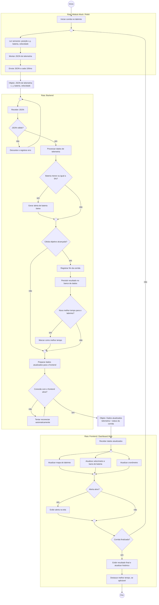

# Projeto Conceitual de Software

- [Explicações adicionais](https://drive.google.com/file/d/1WWIz6609c7Y7zAQRBWHSbX0t2vEJ2z1A/view?usp=sharing)
- [Noções de UML](https://drive.google.com/file/d/1l1yt2ittHuRKIXVXYT76P1HriR07pK-t/view?usp=sharing)
- [Requisitos](https://engsoftmoderna.info/cap3.html)

> **Itens fundamentais:**
> - **Diagrama Atividades UML:** descrever e explicar o fluxo do comportamento funcional do produto proposto, evidenciando, de forma clara e estruturada, como as atividades são executadas, em que ordem e sob quais condições. Esse diagrama permite compreender o funcionamento dinâmico do sistema, destacando:
>   - os principais atores (usuários ou sistemas externos) envolvidos no processo;
>   - as atividades de negócio realizadas por cada ator ou pelo próprio sistema;
>   - os insumos (entradas) necessários para a execução das atividades;
>   - os resultados (saídas) gerados ao longo do fluxo;
>   - os pontos de decisão, paralelismo e sincronização das atividades;
>   - Entre as notações mais relevantes, destacam-se o estado inicial e final, atividades, nós de decisão e junção, barras de bifurcação, Raias (*swimlanes*) e Fluxos de controle.
> - **_Backlog_ do Produto**
>   - Detalhar os requisitos funcionais (RF) com a técnica de documentação e especificação de história de usuário (HU);
>   - Protótipos de interface gráfica do *software* em alta fidelidade.
>     - **Todas HUs devem conter sua descrição (Eu-Como-Para), critérios de aceitação e protótipos de interface, documentadas no github.**
>   - Exporte as informações do Backlog do Produto no GitHub Projects [em formato CSV](https://docs.github.com/en/issues/planning-and-tracking-with-projects/managing-your-project/exporting-your-projects-data), e [renderize em Markdown](https://www.google.com/search?q=convert+CSV+file+to+Markdown+table) no formato a seguir:

## Diagrama de Atividades (UML)

O diagrama abaixo descreve o fluxo funcional do sistema, com três raias (*swimlanes*): **Módulo Mock/Robô**, **Backend** e **Frontend/Dashboard Web**, conforme o fluxo de dados definido para o projeto (Módulo Mock/Robô envia JSON → Backend recebe e valida → Frontend atualiza mapa e bateria).

- **Atores:** Módulo Mock/Robô (sistema externo que simula o Micromouse físico), Backend (serviço que recebe, valida e persiste a telemetria) e Frontend/Dashboard Web (interface de acompanhamento em tempo real).
- **Insumos/resultados (nós de objeto):** o JSON de telemetria (x, y, bateria, velocidade), gerado a cada 100 ms (RNF-15), é o insumo que cruza da raia do Robô para o Backend; os dados atualizados de telemetria e status são o resultado que cruza do Backend para o Frontend. Ambos aparecem como nós de objeto (retângulos duplos) nos pontos em que atravessam as raias.
- **Resultados finais:** atualização em tempo real do dashboard (RF-13), alerta de bateria baixa, histórico de corridas persistido (RF-14) e destaque do melhor tempo por labirinto (RF-15).
- **Decisões:** validade do JSON recebido, nível de bateria, se a célula objetivo foi alcançada, se o tempo registrado é o melhor para aquele labirinto e se a conexão com o frontend está ativa.
- **Nós de junção (merge):** losangos sem rótulo explícitos nos pontos onde fluxos alternativos se reencontram antes de seguir — antes de "Receber JSON" (fluxo normal x reenvio após erro), antes de "Célula objetivo alcançada?" (com/sem alerta de bateria), antes de "Preparar dados atualizados" (com/sem novo melhor tempo), antes de "Corrida finalizada?" (com/sem alerta exibido) e antes de "Ler sensores" (início da corrida x próximo ciclo de telemetria).
- **Paralelismo/sincronização:** ao receber os dados atualizados, o Frontend dispara em paralelo (barra de bifurcação) a atualização do mapa, do velocímetro/bateria e do cronômetro, sincronizando (barra de junção) antes de checar alertas e status da corrida.
- **Resiliência de conexão (RNF-18):** antes de entregar os dados ao Frontend, o Backend verifica se a conexão está ativa; se estiver perdida, tenta reconectar automaticamente em loop até restabelecer a sessão, sem precisar reiniciar o monitoramento — atendendo à exigência de retomada automática após queda de conexão.

### Requisitos Funcionais

<u>RF-00/Épico-00: Título do RF/Épico</u>

| ID (Link Github Projects) | Título | Prioridade |
|:------| :-- | :--- |
| HU-00 | | |
| HU-01 | | |
| HU-02 | | |

<u>RF-01/Épico-01: Título do RF/Épico</u>

| ID (Link Github Projects) | Título | Prioridade |
|:--------------------------| :-- | :--- |
| HU-03                     | | |
| HU-04                     | | |
| HU-05                     | | |

### Requisitos Não-Funcionais

| ID (Link Github Projects) | Título | Prioridade | Rastreabilidade |
|:--------------------------| :-- | :--- |:----------------|
| RNF-01                    | | | RF-00/HU-00     |
| RNF-02                    | | |                 |
| RNF-03                    | | |                 |

> 
> - **Descrição da arquitetura da solução de _software_ proposta:**
>   - Esta subseção deve contemplar o documento de arquitetura do sistema e deve ser estruturado segundo as visões (4+1) previstas no processo unificado (UP): lógica, de processos; implementação, implantação e dados (substituirá a visão de casos de uso).
>   - Propósito do *software* (qual o seu papel no sistema);
>   - Padrão adotado: MVC, MVP, Microsserviços, Monolítico, etc (Justificar);
>   - Linguagens de programação: Java, Python, C#, JavaScript, etc.
>   - *Frameworks* e bibliotecas: Spring Boot, .NET Core, React, Angular, Django, etc.
>   - Banco de dados: Relacional (PostgreSQL, MySQL, etc) X NãoSQL (MongoDB, etc).
>   - Persistência de dados: Modelo Entidade-Relacionamento (MER) e seu respectivo Diagrama Entidade-Relacionamento (DER), aplicáveis quando a solução utiliza banco de dados relacional; alternativamente, diagrama de estrutura de documentos, empregado nos casos em que a arquitetura adota banco de dados não relacional.
> - **Roteiro de testes funcionais:**
>   - Código do caso de teste;
>   - Nome do caso de teste;
>   - Rastreabilidade: Link do(a) RF/HU associado(a);
>   - Objetivo do caso de teste;
>   - Pré-condições do sistema para o teste ser realizado, quando se aplicar;
>   - Descrição dos procedimentos a serem executados para o teste;
>   - Resultado esperado para o teste ser aprovado (pós-condição após realizado o teste);
