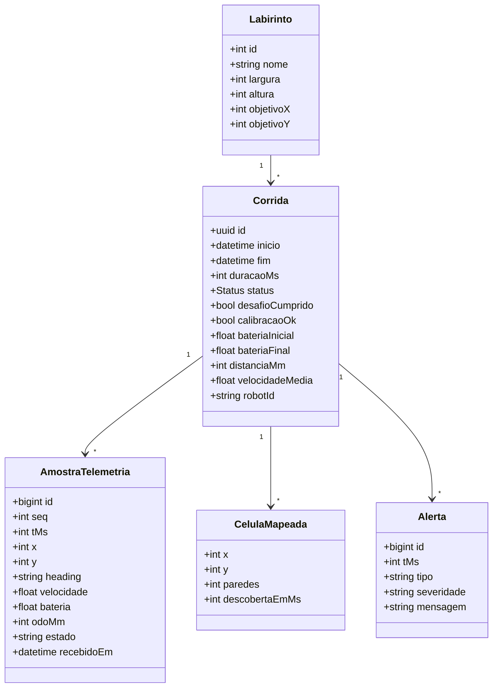
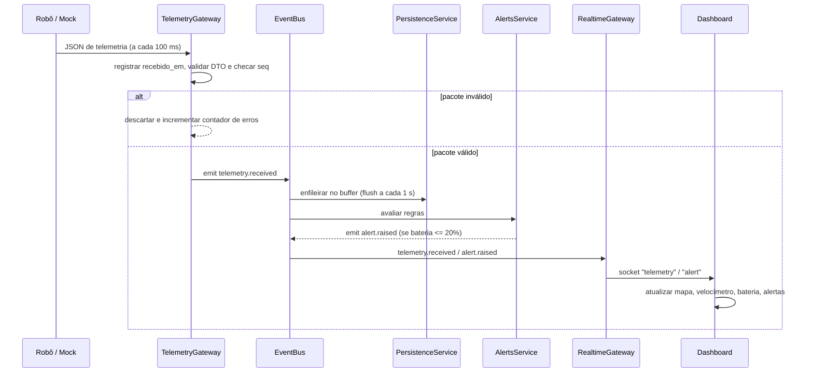
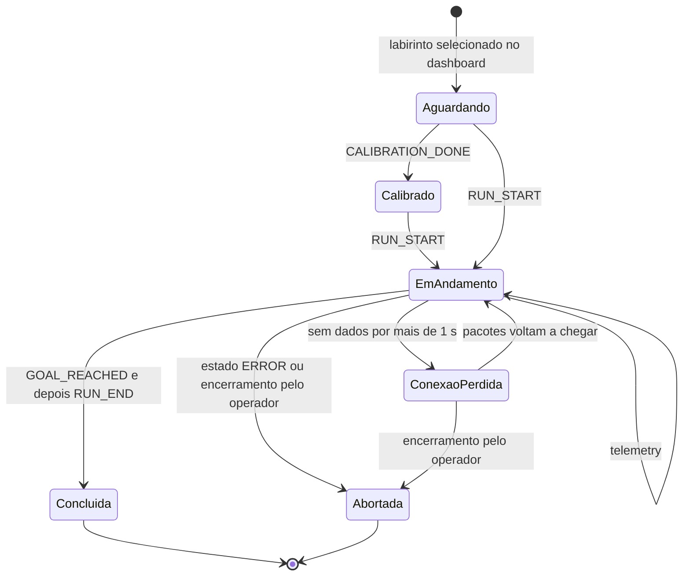
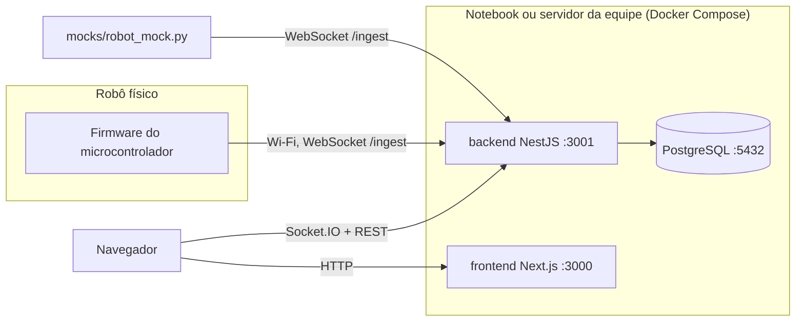

# Documento de Arquitetura — Micromouse (Aplicação Web de Telemetria)

**Modelo:** Visões 4+1 (Kruchten)
**Escopo:** frente de software web: ingestão da telemetria do robô (físico ou mock), processamento em tempo real, dashboard web e histórico de corridas.
**Versão:** 0.2

---

## 1. Objetivo e contexto

O sistema recebe, em tempo real, os dados de telemetria enviados pelo robô micromouse durante a navegação nos labirintos 4×4, 8×4 e 12×4. Com esses dados, ele:

1. valida e processa cada pacote;
2. atualiza o dashboard (mapa do labirinto, velocidade, bateria, cronômetro e alertas) com latência baixa;
3. persiste corridas, amostras, mapa descoberto e alertas em PostgreSQL;
4. permite consultar o histórico e comparar resultados por labirinto, destacando o melhor tempo.

Enquanto o robô físico não está pronto, um **módulo mock** em Python substitui o robô e envia o mesmo contrato JSON. Para o backend, trocar o mock pelo robô deve ser transparente.

**Relação com os requisitos:**

- **Requisitos embarcados:** RF5, RF6, RF8, RF9, RF10 e RF12 são implementados no firmware. A aplicação web não executa essas funções. Ela recebe e exibe seus resultados: paredes detectadas, posição, orientação, mapa, chegada ao objetivo e calibração.
- **Requisitos da web:** RF11, RF13, RF14, RF15, RNF15, RNF17 e RNF18 são atendidos diretamente pela aplicação web.
- **Restrições gerais:** RNF13 e RNF16 são restrições sobre toda a solução.

A seção 8 traz a matriz completa de rastreabilidade.

### 1.1 Decisões principais

| Decisão                        | Escolha                                                       | Justificativa                                                                                                                                                                                                                                                                     |
| ------------------------------ | ------------------------------------------------------------- | --------------------------------------------------------------------------------------------------------------------------------------------------------------------------------------------------------------------------------------------------------------------------------- |
| Padrão arquitetural            | **MVC nas requisições + Event-Driven no fluxo de telemetria** | O MVC organiza as consultas e o CRUD (histórico, labirintos). A telemetria, por sua vez, é um fluxo contínuo de eventos: cada pacote dispara reações independentes (broadcast, persistência, alertas), o que favorece o desacoplamento.                                           |
| Backend                        | **NestJS (TypeScript)**                                       | A equipe já conhece. Os controllers, services e módulos do framework seguem o MVC, e ele oferece suporte nativo a WebSockets (`@nestjs/websockets`) e a eventos internos (`@nestjs/event-emitter`). Usar TypeScript no front e no back permite compartilhar os tipos do contrato. |
| Frontend                       | **Next.js (React)**                                           | A equipe já conhece. As páginas de histórico podem ser renderizadas no servidor e o dashboard em tempo real fica em componentes client.                                                                                                                                           |
| Banco de dados                 | **PostgreSQL**                                                | Requisito do projeto. É relacional, adequado ao histórico (corridas × labirintos) e tem `JSONB` para dados de sensores com formato ainda instável.                                                                                                                                |
| ORM                            | **Prisma** (alternativa: TypeORM)                             | Oferece schema declarativo, migrações versionadas e tipagem gerada automaticamente.                                                                                                                                                                                               |
| Mock do robô                   | **Python**                                                    | É simples de escrever e de rodar no terminal, e a equipe conhece a linguagem. Também serve como base para scripts de análise.                                                                                                                                                     |
| Transporte robô → backend      | **WebSocket** (JSON)                                          | Mantém a conexão aberta, suporta 10 Hz com folga e é bem suportado no ESP32 e em Python. O MQTT fica registrado como evolução possível (ver seção 9).                                                                                                                             |
| Direção da comunicação         | **Unidirecional: robô → web**                                 | A aplicação web não envia comandos, código nem mapa ao robô. Isso garante por construção o RNF13, que proíbe alterações manuais durante a prova.                                                                                                                                  |
| Transporte backend → navegador | **Socket.IO**                                                 | Oferece reconexão automática, salas por corrida e integração pronta com o NestJS.                                                                                                                                                                                                 |
| Execução                       | **Docker Compose**                                            | Um único comando sobe o PostgreSQL, o backend e o frontend, com o mesmo ambiente para todos da equipe.                                                                                                                                                                            |

---

## 2. Contrato de dados (telemetria)

Este é o elemento central da arquitetura. O mock, o firmware e o backend precisam seguir o mesmo contrato.

### 2.1 Mensagem de telemetria (enviada a cada 100 ms)

```json
{
  "v": 1,
  "type": "telemetry",
  "robot_id": "mm-01",
  "seq": 1532,
  "t_ms": 153200,
  "pos": { "x": 2, "y": 1 },
  "heading": "N",
  "speed_mm_s": 240.5,
  "odo_mm": 18320,
  "battery_pct": 76.2,
  "walls": { "n": true, "e": false, "s": false, "w": true },
  "state": "EXPLORING"
}
```

| Campo            | Tipo    | Regra de validação                                                                                          |
| ---------------- | ------- | ----------------------------------------------------------------------------------------------------------- |
| `v`              | inteiro | versão do contrato; deve ser igual a 1                                                                      |
| `type`           | string  | `telemetry` ou `event`                                                                                      |
| `seq`            | inteiro | cresce a cada mensagem, incluindo eventos; lacunas indicam perda e repetições são descartadas (RNF18)       |
| `t_ms`           | inteiro | tempo desde o início da corrida, medido no relógio do robô                                                  |
| `pos.x`, `pos.y` | inteiro | dentro das dimensões do labirinto ativo                                                                     |
| `heading`        | enum    | `N`, `E`, `S`, `W`                                                                                          |
| `speed_mm_s`     | número  | ≥ 0; velocidade instantânea                                                                                 |
| `odo_mm`         | inteiro | opcional; distância acumulada pela odometria desde `RUN_START`, usada no cálculo da velocidade média (RF13) |
| `battery_pct`    | número  | de 0 a 100                                                                                                  |
| `walls`          | objeto  | opcional; paredes detectadas na célula atual                                                                |
| `state`          | enum    | `IDLE`, `EXPLORING`, `RETURNING`, `SPEED_RUN`, `GOAL_REACHED`, `ERROR`                                      |

### 2.2 Mensagens de evento (enviadas quando ocorrem)

```json
{ "v": 1, "type": "event", "robot_id": "mm-01", "seq": 0,    "t_ms": 0,      "event": "CALIBRATION_DONE", "ok": true }
{ "v": 1, "type": "event", "robot_id": "mm-01", "seq": 1,    "t_ms": 0,      "event": "RUN_START", "battery_pct": 98.0 }
{ "v": 1, "type": "event", "robot_id": "mm-01", "seq": 1843, "t_ms": 184250, "event": "GOAL_REACHED", "pos": { "x": 3, "y": 3 } }
{ "v": 1, "type": "event", "robot_id": "mm-01", "seq": 1900, "t_ms": 190000, "event": "RUN_END" }
```

| Evento             | Requisito | Significado                                                                                                          |
| ------------------ | --------- | -------------------------------------------------------------------------------------------------------------------- |
| `CALIBRATION_DONE` | RF12      | O robô terminou a calibração automática dos sensores. `ok` indica se ela teve sucesso.                               |
| `RUN_START`        | RF11      | Início da corrida; informa a bateria inicial.                                                                        |
| `GOAL_REACHED`     | RF10      | O robô identificou sozinho a célula objetivo. Esse evento marca o desafio como cumprido e fixa o tempo de conclusão. |
| `RUN_END`          | RF11      | Fim da transmissão da corrida, que pode incluir o retorno à origem.                                                  |

**Associação com o labirinto:** antes da corrida, o operador seleciona no dashboard qual labirinto será usado (4×4, 8×4 ou 12×4). Quando chega o evento `RUN_START`, o backend abre uma corrida vinculada a esse labirinto. Isso não conta como intervenção humana durante a execução, porque a seleção acontece antes do início.

### 2.3 Métricas derivadas (RF13)

O backend calcula as métricas abaixo a cada pacote e as envia ao dashboard junto com a telemetria.

| Métrica                | Cálculo                                                                                         |
| ---------------------- | ----------------------------------------------------------------------------------------------- |
| Tipo do labirinto      | o labirinto selecionado para a corrida (4×4, 8×4 ou 12×4)                                       |
| Trajeto percorrido     | a sequência de células `pos` visitadas, com as repetições consecutivas removidas                |
| Consumo de bateria     | bateria em `RUN_START` menos a bateria atual, em pontos percentuais                             |
| Velocidade média       | `odo_mm` dividido pelo tempo decorrido; sem odometria, usa a média das amostras de `speed_mm_s` |
| Tempo de conclusão     | `t_ms` no momento de `GOAL_REACHED`; antes disso, o dashboard mostra o cronômetro em andamento  |
| Desafio cumprido (S/N) | **S** se a corrida recebeu `GOAL_REACHED`; **N** caso contrário                                 |

### 2.4 Canal unidirecional (RNF13)

- **Sem canal de escrita:** o backend não expõe nenhum endpoint, tópico ou mensagem capaz de escrever no robô, seja código, mapa ou parâmetros.
- **Uso da conexão pelo robô:** o WebSocket de ingestão serve apenas para enviar dados. Mensagens que o servidor mandar pela conexão são ignoradas pelo firmware.
- **Manutenção entre provas:** qualquer ajuste de firmware ou parâmetros acontece somente fora da prova, por gravação física.

---

## 3. Visão de Cenários (+1)

Os cenários ligam as demais visões às Histórias de Usuário (HU-01 a HU-06). Cada cenário abaixo deve ser vinculado às HUs correspondentes no GitHub Projects.

| #   | Cenário                                                                                                                                                                                                                                                                         | Requisitos                              | Elementos envolvidos                                                                     |
| --- | ------------------------------------------------------------------------------------------------------------------------------------------------------------------------------------------------------------------------------------------------------------------------------- | --------------------------------------- | ---------------------------------------------------------------------------------------- |
| C1  | **Acompanhar a corrida ao vivo:** o usuário abre o dashboard e vê o tipo do labirinto, o trajeto sendo desenhado, as paredes descobertas, o consumo de bateria, a velocidade média e o cronômetro.                                                                              | RF5, RF6, RF9, RF11, RF13, RNF15, RNF17 | Mock/Robô → TelemetryGateway → EventBus → RealtimeGateway → Dashboard                    |
| C2  | **Calibração antes da prova:** o robô conclui a calibração automática e o dashboard mostra "Sensores calibrados" antes da largada.                                                                                                                                              | RF12                                    | Evento `CALIBRATION_DONE` → RunsService → Dashboard                                      |
| C3  | **Alerta de bateria baixa:** a bateria chega a 20% e o sistema mostra um aviso; a 5%, mostra um alerta crítico.                                                                                                                                                                 | RF13                                    | AlertsService (regras) → `alert.raised` → Dashboard + tabela `alertas`                   |
| C4  | **Queda e retomada da conexão:** o Wi-Fi cai por alguns segundos. O dashboard indica a queda e, quando a rede volta, retoma a atualização na mesma sessão, sem recarregar a página nem reiniciar a corrida. Os pacotes guardados pelo robô durante a queda completam o trajeto. | RNF18                                   | Watchdog → `robot.disconnected` / `robot.reconnected`; reconexão do Socket.IO + snapshot |
| C5  | **Chegada ao objetivo:** o robô envia `GOAL_REACHED`, o cronômetro para, o tempo de conclusão é registrado e o indicador "Desafio cumprido" passa para **S**.                                                                                                                   | RF10, RF13                              | RunsService → tabela `corridas`                                                          |
| C6  | **Consultar o histórico:** o usuário vê o histórico geral ou filtra por labirinto, com o melhor tempo de cada labirinto destacado.                                                                                                                                              | RF14, RF15                              | Página Histórico → `GET /runs` e `GET /runs/best` → RunsController → PostgreSQL          |
| C7  | **Reproduzir uma corrida (opcional):** o usuário escolhe uma corrida antiga e vê o trajeto reconstruído a partir das amostras salvas.                                                                                                                                           | RF14                                    | `GET /runs/:id/samples` → componente de mapa                                             |

---

## 4. Visão Lógica

A visão lógica descreve os módulos do backend (organizados em MVC) e as entidades do domínio.

### 4.1 Mapeamento do MVC

| Camada         | Onde fica                                                                                                           | Responsabilidade                                        |
| -------------- | ------------------------------------------------------------------------------------------------------------------- | ------------------------------------------------------- |
| **Model**      | Entidades Prisma + Services (`RunsService`, `MazesService`, `TelemetryService`, `AlertsService`)                    | regras de negócio e acesso a dados                      |
| **Controller** | Controllers REST (`RunsController`, `MazesController`) e Gateways WebSocket (`TelemetryGateway`, `RealtimeGateway`) | recebem requisições ou mensagens e delegam aos services |
| **View**       | Frontend Next.js (Dashboard e Histórico)                                                                            | apresentação; consome REST e Socket.IO                  |

### 4.2 Módulos do backend (NestJS)

| Módulo              | Responsabilidade                                                                                                                                                                                                                                                         |
| ------------------- | ------------------------------------------------------------------------------------------------------------------------------------------------------------------------------------------------------------------------------------------------------------------------ |
| `TelemetryModule`   | Recebe o WebSocket do robô ou mock, registra o horário de recebimento (`recebido_em`), valida o JSON com DTO e `class-validator` e descarta duplicatas por `seq`. Também mede a taxa efetiva em Hz (RNF15), roda o watchdog de conexão (RNF18) e emite eventos internos. |
| `RunsModule`        | Controla o ciclo de vida da corrida, mantém o trajeto e o mapa descoberto e calcula as métricas do RF13. Expõe o REST do histórico e do melhor tempo (RF14 e RF15) e o snapshot da corrida ativa (RNF18).                                                                |
| `MazesModule`       | Cadastra os três labirintos (seed) e guarda a configuração do labirinto ativo.                                                                                                                                                                                           |
| `AlertsModule`      | Aplica as regras de alerta e emite `alert.raised`. As regras cobrem bateria (20% e 5%), perda de conexão, taxa abaixo de 10 Hz, estado `ERROR` e falha de calibração.                                                                                                    |
| `RealtimeModule`    | Gateway Socket.IO voltado ao navegador. Repassa os eventos internos para a sala da corrida ativa sem reduzir a frequência, e reenvia o snapshot quando um navegador se reconecta.                                                                                        |
| `PersistenceModule` | Mantém um buffer das amostras e grava em lote (a cada 1 s); também grava alertas e células mapeadas.                                                                                                                                                                     |

### 4.3 Eventos internos (Event-Driven)

| Evento                                     | Emitido por                                            | Consumido por                              |
| ------------------------------------------ | ------------------------------------------------------ | ------------------------------------------ |
| `telemetry.received`                       | TelemetryModule                                        | Realtime, Persistence, Alerts, Runs (mapa) |
| `run.started`                              | RunsModule                                             | Realtime, Persistence                      |
| `run.goal_reached`                         | RunsModule                                             | Realtime, Persistence                      |
| `run.finished`                             | RunsModule                                             | Realtime, Persistence                      |
| `maze.cell_discovered`                     | RunsModule                                             | Realtime, Persistence                      |
| `alert.raised`                             | AlertsModule                                           | Realtime, Persistence                      |
| `run.calibrated`                           | RunsModule                                             | Realtime, Persistence                      |
| `robot.disconnected` / `robot.reconnected` | TelemetryModule (watchdog)                             | Realtime, Alerts                           |
| `telemetry.rate_low`                       | TelemetryModule (taxa abaixo de 10 Hz por mais de 2 s) | Alerts, Realtime                           |

Cada consumidor reage ao evento sem conhecer quem o emitiu. Por isso, é possível adicionar uma nova regra de alerta ou uma nova tela sem alterar a ingestão.

### 4.4 Modelo de domínio



### 4.5 Esquema no PostgreSQL

```sql
CREATE TABLE labirintos (
  id          SERIAL PRIMARY KEY,
  nome        TEXT NOT NULL UNIQUE,        -- '4x4', '8x4', '12x4'
  largura     SMALLINT NOT NULL,
  altura      SMALLINT NOT NULL,
  objetivo_x  SMALLINT NOT NULL,
  objetivo_y  SMALLINT NOT NULL
);

CREATE TYPE status_corrida AS ENUM ('EM_ANDAMENTO', 'CONCLUIDA', 'ABORTADA');

CREATE TABLE corridas (
  id               UUID PRIMARY KEY DEFAULT gen_random_uuid(),
  labirinto_id     INT NOT NULL REFERENCES labirintos(id),
  robot_id         TEXT NOT NULL,
  fonte            TEXT NOT NULL DEFAULT 'MOCK',   -- 'MOCK' | 'ROBO'
  inicio           TIMESTAMPTZ NOT NULL,
  fim              TIMESTAMPTZ,
  duracao_ms       INT,                           -- tempo de conclusão (t_ms do GOAL_REACHED)
  status           status_corrida NOT NULL DEFAULT 'EM_ANDAMENTO',
  desafio_cumprido BOOLEAN NOT NULL DEFAULT FALSE, -- S/N (RF13)
  calibracao_ok    BOOLEAN,                        -- RF12
  bateria_inicial  REAL,
  bateria_final    REAL,                           -- consumo = inicial - final
  distancia_mm     INT,
  velocidade_media REAL                            -- mm/s
);
CREATE INDEX ix_corridas_labirinto_duracao ON corridas (labirinto_id, duracao_ms)
  WHERE status = 'CONCLUIDA';

CREATE TABLE amostras_telemetria (
  id          BIGSERIAL PRIMARY KEY,
  corrida_id  UUID NOT NULL REFERENCES corridas(id) ON DELETE CASCADE,
  seq         INT NOT NULL,
  t_ms        INT NOT NULL,
  x           SMALLINT NOT NULL,
  y           SMALLINT NOT NULL,
  heading     CHAR(1) NOT NULL,
  velocidade  REAL NOT NULL,
  bateria     REAL NOT NULL,
  odo_mm      INT,
  estado      TEXT NOT NULL,
  recebido_em TIMESTAMPTZ NOT NULL,         -- horário de chegada ao backend (medição do RNF17)
  extras      JSONB,                        -- leituras brutas de sensores (opcional)
  UNIQUE (corrida_id, seq)                  -- descarta pacotes reenviados após reconexão (RNF18)
);

CREATE TABLE celulas_mapeadas (
  corrida_id        UUID NOT NULL REFERENCES corridas(id) ON DELETE CASCADE,
  x                 SMALLINT NOT NULL,
  y                 SMALLINT NOT NULL,
  paredes           SMALLINT NOT NULL,      -- bitmask N=1, E=2, S=4, W=8
  descoberta_em_ms  INT NOT NULL,
  PRIMARY KEY (corrida_id, x, y)
);

CREATE TABLE alertas (
  id          BIGSERIAL PRIMARY KEY,
  corrida_id  UUID REFERENCES corridas(id) ON DELETE CASCADE,
  t_ms        INT NOT NULL,
  tipo        TEXT NOT NULL,                -- 'BATERIA_BAIXA', 'CONEXAO_PERDIDA', ...
  severidade  TEXT NOT NULL,                -- 'INFO' | 'AVISO' | 'CRITICO'
  mensagem    TEXT NOT NULL
);
```

**Consulta de melhor tempo por labirinto** (usada na tela de Histórico):

```sql
SELECT DISTINCT ON (l.id) l.nome, c.id, c.duracao_ms, c.inicio
FROM corridas c JOIN labirintos l ON l.id = c.labirinto_id
WHERE c.status = 'CONCLUIDA' AND c.desafio_cumprido
ORDER BY l.id, c.duracao_ms ASC;
```

**Endpoints REST de consulta (RF14 e RF15):**

| Método e rota               | Uso                                                                                             |
| --------------------------- | ----------------------------------------------------------------------------------------------- |
| `GET /runs`                 | histórico geral, paginado e ordenado por data                                                   |
| `GET /runs?mazeId=2`        | consulta isolada por labirinto                                                                  |
| `GET /runs/best`            | melhor tempo de cada labirinto; o front usa essa resposta para destacar as linhas no histórico  |
| `GET /runs/:id`             | detalhes e métricas de uma corrida                                                              |
| `GET /runs/:id/samples`     | amostras, para reproduzir o trajeto                                                             |
| `GET /runs/active/snapshot` | estado completo da corrida ativa (mapa, trajeto, métricas, alertas), usado na reconexão (RNF18) |

Somente corridas com desafio cumprido concorrem ao melhor tempo.

**Volume esperado:** a 10 Hz, uma corrida de 5 minutos gera cerca de 3.000 amostras. É um volume pequeno para o PostgreSQL, e a gravação em lote evita uma transação por pacote.

---

## 5. Visão de Processo

A visão de processo descreve o comportamento em tempo de execução, a concorrência e o fluxo de dados. Ela também serve de base para o **Diagrama de Atividades** da Frente 1.

### 5.1 Fluxo de um pacote de telemetria



### 5.2 Ciclo de vida da corrida



Uma queda de conexão **não encerra a corrida** automaticamente. A corrida fica no estado `ConexaoPerdida` e volta a `EmAndamento` assim que os pacotes chegam de novo (RNF18). Apenas o operador pode abortar uma corrida, e somente depois que o robô parou, para não configurar intervenção durante a prova.

### 5.3 Concorrência e desempenho

- **Um único processo NestJS** é suficiente, porque há apenas um robô, 10 mensagens por segundo e poucos navegadores. O event loop do Node processa tudo de forma assíncrona.
- **Broadcast sem redução (RNF15):** cada pacote é repassado imediatamente ao navegador, sem agregação nem descarte. O front aplica cada pacote ao estado e redesenha no próximo quadro (`requestAnimationFrame`, cerca de 60 fps). Como a tela atualiza muito acima de 10 Hz, todo pacote aparece na tela.
- **Monitoramento da frequência (RNF15):** o TelemetryModule calcula a taxa efetiva numa janela deslizante de 1 s, e o dashboard mostra esse valor (por exemplo, "10,0 Hz"). Se a taxa ficar abaixo de 10 Hz por mais de 2 s, o sistema emite `telemetry.rate_low`.
- **Persistência fora do caminho crítico:** um buffer em memória é gravado a cada 1 s ou a cada 50 amostras, o que ocorrer primeiro, com `createMany` e `skipDuplicates`. A gravação no banco nunca atrasa o broadcast. No fim da corrida, é feito um flush forçado.
- **Watchdog:** se passar mais de 1 s sem pacotes, o backend emite `robot.disconnected` e a corrida passa ao estado `ConexaoPerdida`, sem ser abortada.

### 5.4 Latência de exibição (RNF17)

- **Requisito:** no máximo **500 ms** entre o recebimento do pacote pelo backend e sua exibição na tela.
- **Meta interna:** menos de 100 ms em rede local, o que deixa folga para variações da rede.
- **Instrumentação:** o backend anexa `recebido_em` a cada mensagem enviada ao navegador. O front estima a diferença entre o relógio do navegador e o do servidor por meio do ping do Socket.IO e registra o momento em que desenha o quadro. Um painel de depuração mostra a latência média e o p95.
- **Critério de aceite:** p95 abaixo de 500 ms em uma corrida completa com o mock, e o mesmo teste repetido com o robô físico.

> **Ponto a confirmar com a equipe:** o RNF17 foi interpretado como "recebimento pelo sistema web", ou seja, pelo backend. Se a intenção for medir desde o envio pelo robô, a mesma instrumentação serve, desde que o robô envie o horário sincronizado por NTP.

### 5.5 Reconexão automática (RNF18)

A reconexão é tratada nos dois trechos do caminho, e em nenhum deles é preciso reiniciar a sessão de monitoramento.

**Robô ou mock → backend**

1. Ao perder o WebSocket, o robô tenta reconectar com espera crescente (0,5 s, 1 s, 2 s, e depois a cada 2 s).
2. Durante a queda, o robô guarda os pacotes num buffer circular (por exemplo, os últimos 30 s, cerca de 300 pacotes).
3. Ao reconectar, o robô reenvia o buffer em ordem de `seq` e depois volta ao fluxo normal.
4. O backend associa os pacotes à **mesma corrida ativa** pelo `robot_id`, descarta duplicatas com `UNIQUE (corrida_id, seq)` e emite `robot.reconnected`.

**Backend → navegador**

1. O Socket.IO reconecta sozinho, sem recarregar a página.
2. No evento `connect`, o front volta a entrar na sala da corrida e o backend envia o **snapshot** (`GET /runs/active/snapshot`), com mapa, trajeto, métricas e alertas, para preencher o que ficou faltando.
3. Enquanto a conexão está caída, o dashboard mostra o indicador "Reconectando…" e mantém os últimos dados visíveis.

**Reinício do backend:** o estado da corrida ativa é reconstruído a partir do banco, a partir das corridas com status `EM_ANDAMENTO`. Se houver perda de até 1 s de amostras que ainda estavam no buffer, o reenvio feito pelo robô a recupera.

---

## 6. Visão de Desenvolvimento

A visão de desenvolvimento descreve a organização do código, as dependências e as convenções.

### 6.1 Estrutura do repositório (monorepo)

```
micromouse/
├── frontend/                 # Next.js (React + TypeScript)
│   ├── app/
│   │   ├── page.tsx          # Dashboard (tempo real)
│   │   └── historico/page.tsx
│   ├── components/
│   │   ├── MazeMap.tsx       # grade SVG/Canvas: paredes, posição e trajeto (RF13)
│   │   ├── MazeTypeBadge.tsx # tipo do labirinto
│   │   ├── Speedometer.tsx   # velocidade instantânea e média
│   │   ├── BatteryBar.tsx    # nível e consumo
│   │   ├── RunTimer.tsx      # cronômetro e tempo de conclusão
│   │   ├── ChallengeFlag.tsx # desafio cumprido S/N
│   │   ├── ConnectionStatus.tsx # taxa (Hz), latência, "Reconectando…"
│   │   └── AlertPanel.tsx
│   ├── hooks/useTelemetry.ts # conexão Socket.IO
│   └── lib/api.ts            # chamadas REST
├── backend/                  # NestJS (TypeScript)
│   ├── src/
│   │   ├── telemetry/        # gateway de ingestão, DTOs, watchdog
│   │   ├── runs/             # controller REST, service, mapa descoberto
│   │   ├── mazes/
│   │   ├── alerts/
│   │   ├── realtime/         # gateway Socket.IO para o navegador
│   │   └── persistence/
│   └── prisma/
│       ├── schema.prisma
│       └── seed.ts           # labirintos 4x4, 8x4, 12x4
├── mocks/                    # Python
│   ├── robot_mock.py         # robô virtual (JSON a cada 100 ms)
│   ├── mazes/                # labirintos em arquivo para o mock percorrer
│   └── requirements.txt
├── shared/
│   └── telemetry.schema.json # contrato versionado (fonte da verdade)
├── docs/
│   ├── arquitetura.md        # este documento
│   └── diagramas/
├── docker-compose.yml
└── README.md
```

### 6.2 Contrato compartilhado

O arquivo `shared/telemetry.schema.json` (JSON Schema) é a fonte da verdade do contrato. A partir dele:

- o backend gera ou valida seus DTOs;
- o frontend importa os tipos TypeScript;
- o mock em Python valida os pacotes antes de enviar (biblioteca `jsonschema`).

Assim, o firmware do robô físico passa a ter uma especificação clara a seguir.

### 6.3 O mock (`mocks/robot_mock.py`)

- Conecta em `ws://localhost:3001/ingest`.
- Envia `CALIBRATION_DONE` e `RUN_START`, depois um pacote de telemetria a cada 100 ms e, ao final, `GOAL_REACHED` e `RUN_END`.
- Implementa a mesma lógica de reconexão e reenvio que o firmware deverá seguir (seção 5.5), o que permite validar o RNF18 antes do hardware.
- Percorre um labirinto definido em arquivo, o que permite gerar paredes coerentes com o mapa.
- A bateria cai de forma gradual para exercitar os alertas de 20% e 5%.
- Tem parâmetros de linha de comando: `--maze 4x4|8x4|12x4`, `--rate 10`, `--battery-drain`, `--drop-rate` (para simular perda de pacotes), `--disconnect-at` e `--disconnect-for` (para testar a queda e a retomada da conexão), `--calibration-fail` e `--no-goal` (para gerar uma corrida com desafio não cumprido).

Esses parâmetros alimentam diretamente o Roteiro de Testes. Por exemplo, o teste "bateria em 5%" pode ser reproduzido com o mock.

### 6.4 Convenções

- **Branches:** `main` protegida; trabalho em `feat/…` e `fix/…`, integrado via Pull Request com pelo menos um revisor.
- **Issues:** cada HU e RNF vira uma issue no GitHub Projects, e os PRs referenciam as issues (`Closes #12`).
- **Qualidade:** ESLint e Prettier no front e no back; Ruff no mock; testes com Jest (backend) e pytest (mock).
- **CI (opcional):** GitHub Actions rodando lint e testes a cada PR.

---

## 7. Visão Física

A visão física descreve como os componentes são implantados.



| Nó        | Conteúdo                                 | Observações                                                                    |
| --------- | ---------------------------------------- | ------------------------------------------------------------------------------ |
| Robô      | firmware embarcado                       | cliente WebSocket na rede Wi-Fi local; o endereço do backend fica configurável |
| Host      | contêineres `db`, `backend` e `frontend` | `docker compose up` sobe tudo; o volume do PostgreSQL persiste os dados        |
| Navegador | qualquer dispositivo na mesma rede       | acessa `http://<ip-do-host>:3000`                                              |

**Rede no dia da apresentação:** usar um roteador ou hotspot dedicado para o robô e o notebook, evitando redes institucionais com isolamento entre clientes.

---

## 8. Rastreabilidade de requisitos

| Requisito                                      | Como a arquitetura atende                                                                                                                                                                         | Componentes                                        | Verificação                                                                           |
| ---------------------------------------------- | ------------------------------------------------------------------------------------------------------------------------------------------------------------------------------------------------- | -------------------------------------------------- | ------------------------------------------------------------------------------------- |
| **RF5** Detectar paredes                       | Implementado no firmware. A web recebe `walls` a cada pacote e desenha as paredes descobertas.                                                                                                    | contrato `walls`, `celulas_mapeadas`, `MazeMap`    | comparar o mapa exibido com o labirinto real ou o arquivo do mock                     |
| **RF6** Localização e orientação               | Implementado no firmware. A web exibe `pos` e `heading` em tempo real.                                                                                                                            | contrato, `MazeMap`                                | teste de trajeto com o mock                                                           |
| **RF8** Controle de trajetória                 | Implementado exclusivamente no firmware. Opcionalmente, o erro de trajetória vai em `extras` para depuração.                                                                                      | firmware; `extras` (JSONB)                         | testes da equipe embarcada                                                            |
| **RF9** Mapear e navegar                       | Implementado no firmware. A web armazena e exibe o mapa descoberto a cada corrida.                                                                                                                | `maze.cell_discovered`, `celulas_mapeadas`         | reprodução da corrida (C7)                                                            |
| **RF10** Identificar o objetivo                | O firmware detecta a chegada e envia `GOAL_REACHED`; a web marca o desafio como cumprido e para o cronômetro.                                                                                     | evento `GOAL_REACHED`, `RunsService`               | C5; mock com e sem `--no-goal`                                                        |
| **RF11** Transmitir telemetria                 | Contrato JSON versionado e gateway WebSocket de ingestão.                                                                                                                                         | `shared/telemetry.schema.json`, `TelemetryGateway` | validação do schema no mock e no backend                                              |
| **RF12** Calibração automática                 | Implementada no firmware. O evento `CALIBRATION_DONE` é registrado na corrida e exibido no dashboard.                                                                                             | evento, `calibracao_ok`                            | C2; mock com `--calibration-fail`                                                     |
| **RF13** Exibir dados em tempo real            | Tipo do labirinto, trajeto, consumo de bateria, velocidade média, tempo de conclusão e desafio S/N, calculados conforme a seção 2.3.                                                              | `RunsService`, componentes do dashboard            | C1 e C5; casos de teste por indicador                                                 |
| **RF14** Armazenar e consultar                 | Corridas persistidas no PostgreSQL; histórico geral e filtro por labirinto via REST.                                                                                                              | `corridas`, `GET /runs`, página Histórico          | C6                                                                                    |
| **RF15** Destacar o melhor tempo               | Consulta `DISTINCT ON` por labirinto; o front destaca as corridas retornadas.                                                                                                                     | `GET /runs/best`                                   | C6 com várias corridas no mesmo labirinto                                             |
| **RNF13** Sem alteração manual durante a prova | Canal estritamente unidirecional; não existe endpoint de escrita no robô.                                                                                                                         | seção 2.4                                          | inspeção de código: nenhuma rota envia dados ao robô                                  |
| **RNF15** Frequência mínima de 10 Hz           | Envio a cada 100 ms, broadcast sem redução e taxa medida com alerta abaixo de 10 Hz.                                                                                                              | `TelemetryModule`, `ConnectionStatus`              | corrida com o mock; taxa ≥ 10 Hz durante toda a execução                              |
| **RNF16** Desenvolvimento próprio              | Todo o código de domínio (firmware, backend, frontend e mock) é escrito pela equipe. Frameworks e bibliotecas de uso geral são permitidos, mas nenhuma solução robótica comercial pronta é usada. | todo o repositório                                 | revisão de dependências no `package.json` e no `requirements.txt`                     |
| **RNF17** Exibição em até 500 ms               | Broadcast imediato, persistência fora do caminho crítico e latência instrumentada.                                                                                                                | seção 5.4                                          | p95 abaixo de 500 ms no painel de depuração                                           |
| **RNF18** Retomada automática                  | Reconexão com buffer no robô, corrida mantida aberta, reconexão do Socket.IO e snapshot.                                                                                                          | seção 5.5                                          | mock com `--disconnect-at` / `--disconnect-for`; derrubar o backend durante a corrida |

---

## 9. Riscos e evoluções

| Risco / tema                                     | Mitigação                                                                                                                              |
| ------------------------------------------------ | -------------------------------------------------------------------------------------------------------------------------------------- |
| Wi-Fi instável durante a corrida                 | Reconexão automática com buffer e reenvio no robô, snapshot no navegador e corrida mantida aberta durante a queda (seção 5.5).         |
| Latência ou frequência abaixo do exigido         | Taxa e latência medidas continuamente e exibidas no dashboard; testes de carga feitos com o mock antes do hardware (seções 5.3 e 5.4). |
| O contrato mudar durante o semestre              | Campo `v` de versão e schema único em `shared/`.                                                                                       |
| Relógio do robô diferente do relógio do servidor | O tempo da corrida usa `t_ms`, medido pelo robô; o horário do servidor fica apenas como metadado.                                      |
| Mais robôs ou consumidores no futuro             | Trocar a ingestão por um broker **MQTT** (Mosquitto). Os consumidores internos continuam iguais, já que só o gateway muda.             |
| Tempo da equipe                                  | O mock permite desenvolver o front e o back em paralelo ao hardware desde já.                                                          |

---
